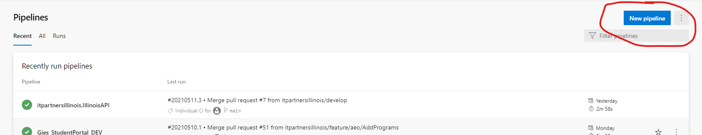
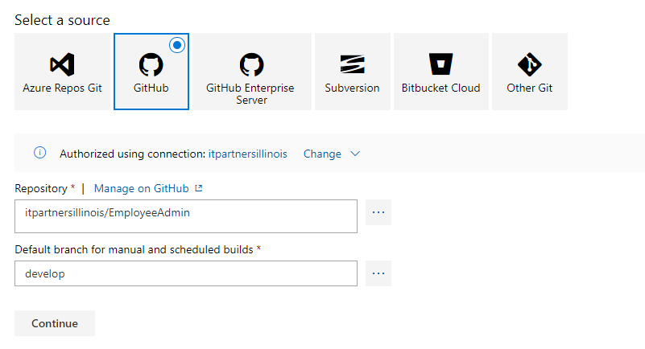
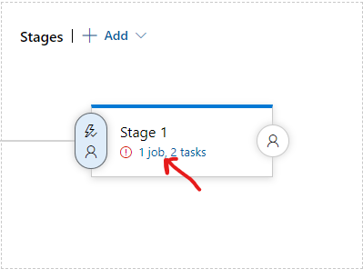
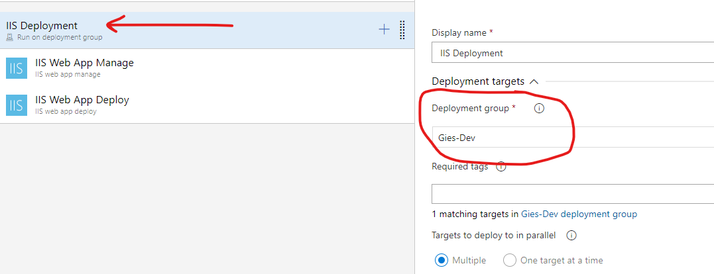
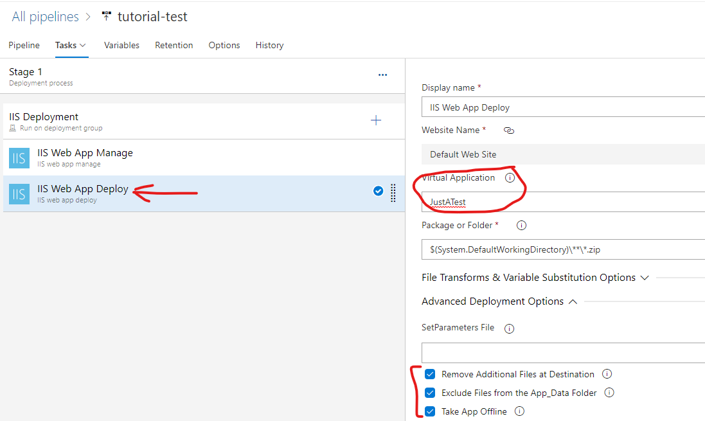

# Creating CI/CD for ASP.Net Core App Hosted On-Premises

## Setting Up Build Pipeline and Continuous Integration

1. Visit [Pipeline](https://dev.azure.com/itpartnersillinois/Pipeline%20Repository%20from%20Gitlab) project in VSTS
2. Click on Pipelines and open the Pipelines tab.
3. Click 'New pipeline'
   
4. Click ```Use the classic editor``` link at the bottom.
5. Under Select a source, choose GitHub
6. Choose your repository and branch (you will set up one pipeline for develop and another for production) so, you should probably choose develop the first time.
    
7. Choose the ASP.NET template
    
8. Name your Pipeline and enter GitHub info
    
9. Click the + sign to add a Task. Search ```Use .NET Core``` and select that.
    
10. Click and drag it to move it to the top of the task list. I think it helps to specify the SDK ex. 3.1.x
    
11. Specify nuget version
    
12. Specify path the the .sln 
13. **IMPORTANT** *If* your project uses DevExpress (if not, you don't need to do this):
    You may encounter errors pulling the DevExpress packages without adding this line in the nuget.config in your project. Look at another project nuget config for easy copy/paste:
    
    Specify the path to the nuget.config file
    
14. You shouldn't need to change anything in the other tasks (Build Solution, Test Assemblies, Publish Symbols Path, Publish Artifact)

Your pipeline should be ready. At this point, you can hit 'Save and Queue' to save your work and see if it builds successfully.

## Setting Up a Release Pipeline and Continuous Deployment

Our project should be built and an artifact of the build is in Azure. We configure Azure to deploy the artifact to our server now.

1. Click the 'Releases' tab and then click the + button to create a new release
   
2. Name the release and in the 'Select a template' panel, search for and select 'IIS website deployment'.
   
3. Click 'Add an artifact' and choose the source build - **make sure to choose the correct environment**
    
4. **Easy to forget step** Click the lightning bolt button in the Artifacts panel and enable Continuous Deployment.
    
5. In the stages panel click on the stage ex. ```1 job, 2 tasks```
   
6. Under IIS Deployment - choose the appropriate Deployment Group for the environment
    
7. Defaults should be fine in ```IIS Web App Manage```
8. In ```IIS Web App Deploy``` - specify the Virtual Application as set up on the server. Click the checkboxes:
   1. Remove Additional Files at Destination
   2. Exclude Files from the App_Data Folder
   3. Take App Offline
    

Your App should be ready to be deployed!

Click Save.

If you ran a build, you can Create a Release here to see if it deploys successfully. 

Alternatively, you can create another build to check that the release triggers correctly after the build finishes.

## Troubleshooting

Some project, settings, etc. can change some of the above. If you encounter build errors or release errors, check the error messages, and see if there are other settings you should modify. These steps should work for most applications, but there may be changes needed for your application.